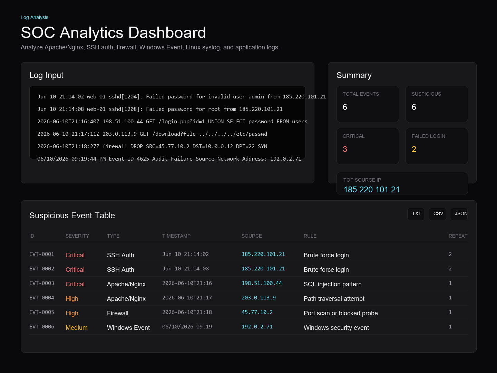

# SOC Analytics Dashboard

SOC Analytics Dashboard is a Next.js log analysis tool for quickly triaging suspicious security events from common infrastructure and application logs. It parses uploaded or pasted logs, detects known security patterns, assigns severity, explains likely root cause and impact, and produces exportable reports for incident review.

## Features

- Rule-based log analysis that works without an API key.
- Supports Apache/Nginx, SSH auth, firewall, Windows Event, Linux syslog, and generic application logs.
- Security detections for brute force login, SQL injection, path traversal, port scan or blocked probe, repeated denied access, service timeout/down events, Windows audit events, and generic errors.
- SOC-style dashboard cards for total events, suspicious events, critical alerts, failed logins, and top source IP.
- Event table with severity, detected log type, timestamp, source IP, rule name, raw log line, and repeated event count.
- Search and filters by keyword, severity, log type, and timestamp text.
- Export filtered reports as TXT, CSV, or JSON.
- Sample log files included for fast testing.

## Project Structure

```text
.
|-- README.md
|-- samples/
|   |-- apache-error.log
|   |-- firewall.log
|   |-- ssh-auth.log
|   `-- windows-event.log
|-- app/
|   |-- api/analyze/route.ts
|   |-- globals.css
|   |-- layout.tsx
|   `-- page.tsx
|-- lib/logAnalyzer.ts
|-- next.config.ts
|-- package.json
|-- tailwind.config.ts
`-- tsconfig.json
```

## Run Locally

```bash
npm install
npm run dev
```

Open `http://localhost:3000`, paste a log or upload one of the files from `samples/`, then click **Analyze Log**.

## Build

```bash
npm run build
```

## Deploy on Vercel

1. Import this GitHub repository into Vercel.
2. Use the repository root as the project root directory.
3. Use the default Next.js build settings:
   - Install command: `npm install`
   - Build command: `npm run build`
   - Output directory: `.next`
4. Deploy.

No OpenAI or external API key is required for the built-in rule-based analyzer.

## Sample Logs

Use these files to test specific detections:

- `samples/ssh-auth.log`: brute force SSH login attempts.
- `samples/apache-error.log`: SQL injection, path traversal, and backend service errors.
- `samples/firewall.log`: blocked probes and scan-like firewall activity.
- `samples/windows-event.log`: Windows logon audit failures and service errors.

## Analysis Output

The analyzer returns:

- `Severity`: Low, Medium, High, or Critical.
- `Detected keywords`: keywords matched in the log line.
- `Possible root cause`: likely explanation for the event.
- `Impact`: why the event matters.
- `Recommended fix`: next action for triage or remediation.
- `Timestamp`: timestamp extracted from the log line when available.
- `Repeated count`: repeated occurrences grouped by source and rule.

Example JSON shape:

```json
{
  "generatedAt": "2026-06-10T14:20:00.000Z",
  "summary": {
    "totalEvents": 6,
    "suspiciousEvents": 5,
    "criticalAlerts": 2,
    "failedLogins": 2,
    "topSourceIp": "185.220.101.21"
  },
  "findings": [
    {
      "id": "EVT-0001",
      "severity": "Critical",
      "logType": "SSH Auth",
      "rule": "Brute force login",
      "sourceIp": "185.220.101.21"
    }
  ]
}
```

## Screenshot

After running locally, the dashboard should look like this:



## Notes

This project is intended for fast triage and portfolio demonstration. It does not replace SIEM correlation, EDR telemetry, or full incident response tooling. Treat findings as signals that should be verified with surrounding logs, asset context, and known-good baselines.
